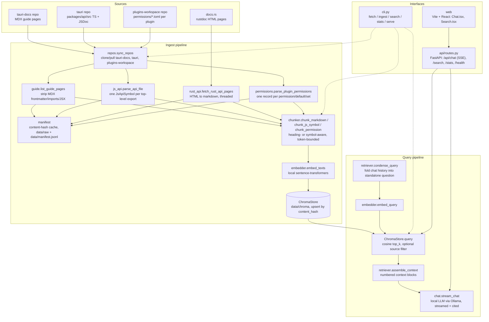

# tauri-assistant

A retrieve-then-generate RAG chatbot over Tauri app framework documentation:
the guide/concept docs (tauri.app), the `@tauri-apps/api` JS/TS reference,
the `tauri` crate's Rust API (docs.rs), and every official plugin's
permissions/capabilities schema.

Uses a local LLM via [Ollama](https://ollama.com)'s OpenAI-compatible API
(`llama3.2` by default) for chat, a local `sentence-transformers`
model (`all-MiniLM-L6-v2`) for embeddings, Chroma as an embedded vector
store, FastAPI for the backend, and a Vite + React frontend.

## Setup

Pull the local chat model with Ollama (make sure `ollama serve` is running):

```bash
ollama pull llama3.2
```

From the repo root:

```bash
uv sync
cp projects/tauri-assistant/.env.example projects/tauri-assistant/.env
```

## Usage

```bash
# Clone doc/API/plugin repos + parse guide/JS-API/permissions (tier 1); tier 2 adds a docs.rs crawl
uv run --package tauri-assistant tauri-assistant fetch --tier 1

# Chunk, embed, and store into Chroma
uv run --package tauri-assistant tauri-assistant ingest --tier 1

# Chunk/doc counts by source
uv run --package tauri-assistant tauri-assistant stats

# Pure retrieval, no LLM
uv run --package tauri-assistant tauri-assistant search "how do I grant a plugin permission to a window"

# API server
uv run --package tauri-assistant tauri-assistant serve
```

Frontend:

```bash
cd projects/tauri-assistant/web
npm install
npm run dev
```

The Vite dev server proxies `/api` to `localhost:8000`.

## Architecture



**Ingest** (`tauri-assistant fetch` / `ingest`, orchestrated by `ingest/pipeline.py`):

1. **Fetch** — `sources/repos.py` shallow-clones/pulls `tauri-docs`, `tauri`, and `plugins-workspace`. `sources/guide.py` reads the MDX/Markdown guide pages straight from the `tauri-docs` clone (stripping frontmatter/imports/JSX). `sources/js_api.py` reads `packages/api/src/*.ts` from the `tauri` clone and segments each file into one record per top-level exported symbol, using its leading JSDoc comment. `sources/permissions.py` reads each plugin's `permissions/*.toml` from `plugins-workspace` into one record per `[[permission]]`, `[default]`, or `[[set]]` entry. `sources/rust_api.py` is the one HTTP-fetched source: it scrapes the `tauri` crate's docs.rs pages (retried via `tenacity`, fetched concurrently), cached as markdown under `data/raw/rust-api/`. Every fetched/parsed unit is recorded in `data/manifest.jsonl` (`sources/manifest.py`) keyed by a content hash.
2. **Chunk** — `ingest/chunker.py` turns each guide/Rust-API markdown page into one chunk per leaf heading section, and each JS API symbol / plugin permission into one chunk. Oversized chunks are token-window-split with overlap. Every chunk gets a breadcrumb prefix (e.g. `@tauri-apps/api > event > listen`, or `fs plugin > permissions > allow-read-file`) so it reads standalone out of context.
3. **Embed + store** — `ingest/embedder.py` batches chunk text through a local `sentence-transformers` model (no API calls); `ingest/store.py` upserts vectors + text + metadata into a persistent Chroma collection (`data/chroma/`), keyed by content hash for idempotent re-ingestion.

**Query** (`tauri-assistant search`, or `/api/chat` / `/api/search`):

1. `rag/retriever.py` condenses the latest question against chat history into a standalone query (skipped on the first turn), embeds it, and queries Chroma for the top-k nearest chunks (optionally filtered by `source`: `guide` / `js-api` / `rust-api` / `permissions`).
2. Retrieved chunks are deduplicated and assembled into numbered context blocks (`rag/prompts.py`).
3. `rag/chat.py` streams a completion from the local LLM (via Ollama's OpenAI-compatible API) grounded in that context via `SYSTEM_PROMPT`, which enforces inline `[n]` citations, calls out required permissions/capabilities, and asks a clarifying question when the desktop/mobile target or Tauri major version is ambiguous. `search`/`/api/search` stop after step 2 (retrieval only, no LLM call).

**Serving**: `api/main.py` wires CORS + `api/routes.py` (FastAPI) on top of the same `ChromaStore`/`stream_chat` used by the CLI; `/api/chat` streams via Server-Sent Events (`sources` → `token`* → `done`). The `web/` (Vite + React) `Chat.tsx` and `Search.tsx` components consume these endpoints directly.

## Tiers

- **Tier 1**: guide/concept docs, the JS/TS API reference, and every plugin's
  permissions schema. Covers everyday app and plugin development.
- **Tier 2**: adds the `tauri` crate's Rust API docs (a ~200-page docs.rs
  crawl) for backend/plugin authors working in Rust.
